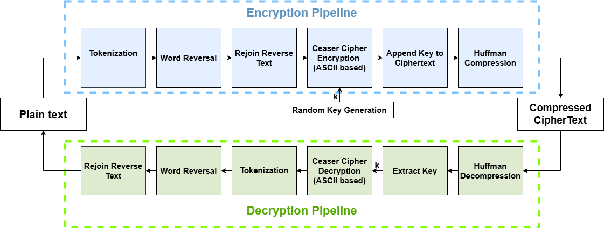

# HRC-Cipher

**HRC-Cipher: A Hybrid Lightweight Reversal, Caesar, and Compression Based Text Encryption Scheme for Small-Scale and Educational Applications**

---

## Overview

**HRC-Cipher** is a lightweight symmetric encryption algorithm tailored for encrypting **short text messages**. It integrates three core techniques:

- Word-level reversal
- Caesar cipher using ASCII-based byte shifting
- Lossless compression (Huffman coding)

The algorithm is ideal for:
- Educational cryptography
- Embedded systems or constrained environments
- Lightweight private communication

---

## How It Works


<p align="center">
  Figure - Block Diagram Of the System
</p>

### Encryption

The encryption process consists of the following stages:

1. **Tokenization**: The input text is split into words.
2. **Reversal**: Each word is reversed to add obfuscation.
3. **Caesar Cipher**: A random key \( k \in [1,95] \) is chosen and applied via ASCII Caesar cipher.
4. **Key Hint**: The Caesar key is encoded (1 → '!', ..., 95 → '~') and appended to the encrypted string.
5. **Compression**: Huffman encoding is used to compress the ciphertext.

### Decryption

The process is reversed:
- Decompress
- Extract and decode the key hint
- Apply inverse Caesar cipher
- Reverse words to recover original text

---

## Repository Structure

```
HRC-Cipher/
├── HRC.py              # Main encryption and decryption logic
├── Pipeline.png        # Flow diagram
└── README.md           # This documentation
```

---

## Requirements

- Python 3.x
- No external libraries needed (`random`, `heapq`, `collections` are standard)

---

## Sample Performance

### Sample output

**Original Text:**       Hello! This is Tahrima.<br>
**Reversed Words:**      !olleH sihT si .amirhaT<br>
**Caesar Encrypted:**    |ÊÇÇÀ£{ÎÄï{ÎÄ{‰¼ÈÄÍü¯<br>
**Key Used:**            91<br>
**Key Char:**            »<br>
**Cipher + Key:**        |ÊÇÇÀ£{ÎÄï{ÎÄ{‰¼ÈÄÍü¯»<br>
**Huffman Compressed:**  00101101010101010110111110101111111000100000111111100011111001100001110010111010...<br>
**Compression Ratio:**   0.4792<br>
**Execution Time:**      0.08 ms<br>
**Decrypted Text:**       Hello! This is Tahrima.<br>

### Performance Table for different length of sample

| Input Length | Compressed Bits | Compressed Bits | Compression Ratio | Time (ms) |
|--------------|------------------|------------------|--------------------|-----------|
| 30 chars     | 240              | 111              | 0.46               | 0.08      |
| 63 chars     | 512              | 263              | 0.51               | 0.10      |
| 85 chars     | 680              | 366              | 0.53               | 0.26      |
| 110 chars    | 880              | 461              | 0.54               | 0.28      |
| 176 chars    | 1408             | 718              | 0.51               | 0.20      |
| 394 chars    | 3152             | 1665             | 0.53               | 0.19      |
| 690 chars    | 5520             | 2955             | 0.54               | 0.28      |

---

## Comparison With Existing Lightweight cryptography techniques
The simple design technique and low computational overhead helps HRC-Cipher to outperform XOR in security and surpass TEA and PRESENT in execution time and memory use. A Comparison Table between HRC-Cipher and other esisting lightweight cryptography techniques XOR, TEA and PRESENT is given for input sample -
<p align="center">
"In a quiet village nestled between the hills, people wake early to tend their gardens and prepare fresh meals. Every day feels like a rhythm — the sun rises, children run to school, elders sip tea under banyan trees. The repetition of these simple joys forms the heartbeat of their peaceful routine."
</p>

| Encryption Method | Input Bits | Output Bits | Time (ms) | Memory (KB) |
|-------------------|------------|-------------|-----------|-------------|
| HRC-Cipher        | 2392       | 1904        | 0.70      | 0.26        | 
| XOR               | 2392       | 2392        | 0.05      | 0.66        |
| TEA               | 2392       | 2392        | 1.61      | 598.00      |
| PRESENT           | 2392       | 2392        | 2.12      | 747.50      |

---

## Paper & Credits

This code supports the following extended abstract:

**HRC-Cipher: A Hybrid Lightweight Text Encryption Scheme Based on Reversal, Caesar Cipher, and Compression for Short Messages**  
*IEEE Computer Society Bangladesh Chapter Symposium (BDC Symposium) 2025 — Submitted*  
Author: Tahrima Sayem Sowa

---

## Online Demo / Code Access

- GitHub Repository: [https://github.com/tahrima-sayem/HRC-Cipher/blob/main/HCR.py](https://github.com/tahrima-sayem/HRC-Cipher/blob/main/HCR.py)
- Flow Diagram: Available in `Pipeline.png`

---

## Contact

For questions, suggestions, or collaboration:  
Email: tahrimasowa@gmail.com
